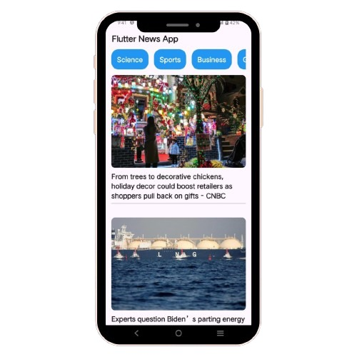

# flutter_news_app

A modern and sleek news application built using Flutter, utilizing the [NewsAPI](https://newsapi.org/) to fetch the latest news from around the globe.

## App Screenshots

Here is a quick look at the app's screenshot:

## 📋 Features

- 🌍 Fetches real-time news from various sources worldwide.
- 🗂 Categorized news: Business, Technology, Sports, Entertainment, Health, and more.
- 🔎 Search functionality for finding news articles by keywords.
- 📱 Responsive design optimized for both Android and iOS.
- 🔗 Clickable links to view full articles in a browser.

## 🚀 How to Run the App

To run the app, you'll need to set up Flutter and Dart on your machine.

### Prerequisites

1. Flutter SDK installed. ([Installation Guide](https://docs.flutter.dev/get-started/install))
2. Android Studio or Visual Studio Code with Flutter plugin installed.
3. An API key from [NewsAPI](https://newsapi.org/) (You can sign up for free to get your key).

After completing these steps, follow these steps to run the app:
- Open Android Studio
- Select Project from version control (VCS) and paste the project URL.
- Project will be imported into Android Studio
- Finally, run the app on an emulator or a physical device.

### Package used in this project
- [http](https://pub.dev/packages/http/install)
- [cached_network_image](https://pub.dev/packages/cached_network_image/install)

